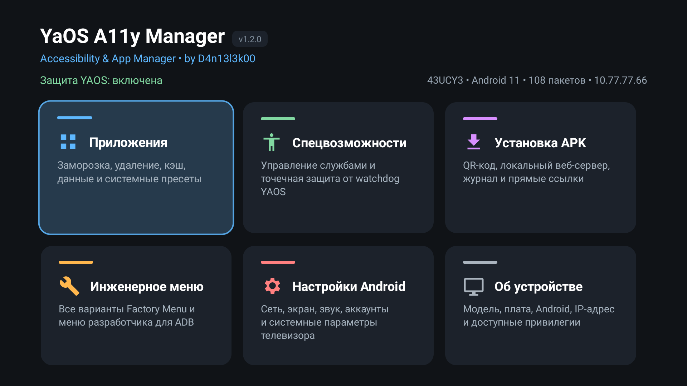

<div align="center">
  <h1>YaOS A11y Manager</h1>
  <p>
    <a href="https://github.com/D4n13l3k00/yaos-a11y-manager/releases/latest"></a>
    <a href="https://developer.android.com/tv"></a>
    <a href="https://github.com/D4n13l3k00/yaos-a11y-manager/actions/workflows/android.yml"></a>
    <a href="LICENSE"></a>
  </p>
  
</div>

> [!NOTE]
> Системный менеджер для Android TV и телевизоров с YaOS. Он показывает полный
> список служб специальных возможностей, защищает выбранные службы от сброса,
> управляет установленными приложениями, принимает APK с телефона и открывает
> инженерное меню.



> [!IMPORTANT]
> Полный автономный режим и native-hook проверены на DEXP 43UCY3 с платой
> TP.MT9632.PB721. Guard-режим не зависит от CVTE и работает на других
> платформах после выдачи `WRITE_SECURE_SETTINGS`. Автоматическое включение ADB
> и root-бэкенды зависят от прошивки.

## ✨ Возможности

### ♿ Специальные возможности

- показывает все установленные accessibility-службы и их фактическое состояние;
- включает и отключает несколько служб без урезанного системного меню YAOS;
- позволяет независимо закрепить состояние каждой службы;
- хранит подтверждённое пользователем состояние отдельно от наблюдаемого состояния Android,
  поэтому внешний сброс не становится новой конфигурацией восстановления;
- перехватывает переходы в штатные экраны
  `android.settings.ACCESSIBILITY_SETTINGS` и
  `android.settings.ACCESSIBILITY_TV_OEM_LINK`;
- обнаруживает службы через `AccessibilityManager`, intent-запрос и прямую проверку
  объявленных сервисов, включая отключённые компоненты;
- восстанавливает защиту после перезагрузки, пробуждения и обновления приложения;
- наблюдает обе secure-настройки, выполняет отложенную сверку после изменений и
  контрольную проверку каждые 30 секунд;
- сохраняет состояние незакреплённых служб и откатывает запись, если Android её
  не подтвердил;
- позволяет временно отключить или повторно запустить защиту из интерфейса.

### 📦 Менеджер приложений

- пользовательские, системные, замороженные и удалённые для профиля пакеты;
- запуск, принудительная остановка, заморозка и разморозка;
- очистка кэша отдельного приложения или всех приложений;
- стирание данных с подтверждением;
- удаление пакета для текущего пользователя и восстановление системного пакета;
- полное удаление пользовательского APK;
- пресеты плагинов Яндекс, Android и эфирного ТВ с частичным выбором,
  обратным включением и защитой `com.yandex.tv.services.platform`;
- установка APK по прямой ссылке.

Системный APK при удалении для пользователя остаётся в прошивке. Его можно
вернуть кнопкой восстановления. Полное удаление доступно только для
пользовательских APK.

### 📲 Установка с телефона

Отдельный TV-экран поднимает временный HTTP-сервер и показывает QR-код. После
сканирования на телефоне открывается страница, куда можно загрузить APK или
передать прямую ссылку.

### 🔄 OTA-обновления

- фоновая проверка последнего GitHub Release не чаще одного раза в 6 часов;
- отдельный экран с описанием релиза, журналом, скоростью и прогрессом загрузки;
- проверка SHA-256, имени пакета, версии и сертификата подписи до установки;
- штатное обновление через Android Package Installer;
- автоматическая попытка разрешить приложению установку из этого источника через
  доступный ADB/root-бэкенд;
- переход в системные настройки, если разрешение не удалось выдать автоматически.

При доступном обновлении плашка версии на главном экране становится активной.
На Android 11 после загрузки остаётся подтвердить замену приложения в системном
окне. Приватный ключ подписи на телевизор не передаётся.

### 🛠️ Системные инструменты

- запуск штатного `Factory Menu`;
- автоопределение известных Activity, action и CVTE service-команд;
- открытие стандартного и TV-варианта меню разработчика;
- полные настройки Android;
- отдельный экран сведений об устройстве;
- живые статусы ADB, `WRITE_SECURE_SETTINGS`, выбранного root-бэкенда, guard и
  native-hook.

## 📺 Совместимость

Проверенная конфигурация:

| Компонент | Значение |
| --- | --- |
| Телевизор | DEXP 43UCY3 |
| Android | 11 / API 30 |
| Плата | `m7332_eu`, TP.MT9632.PB721 |
| ABI | `armeabi-v7a` |
| YAOS Platform Services | `com.yandex.tv.services.platform` 3.340.28 |
| Factory API | `com.cvte.factory.service/.MainService` |
| Заводской root | Binder-сервис `cvte.at_sudo` |
| Локальный ADB | `127.0.0.1:5555`, `ro.adb.secure=0` |

Если локальный ADB уже включён, приложение сначала пытается выдать
`WRITE_SECURE_SETTINGS` обычной
командой `pm grant`. Для native-hook привилегированный бэкенд выбирается
автоматически: уже запущенный root-adbd, Magisk/`su`, штатный `adb root`, затем
CVTE `at_sudo`.

На прошивке без CVTE приложение не сможет программно включить выключенный ADB,
если производитель не предоставляет другого API. После ручного включения ADB
guard-режим настраивается автоматически. Если `WRITE_SECURE_SETTINGS` уже
выдано, guard работает даже без доступного ADB и root.

### 🔐 Режимы доступа

| Доступ | Что работает |
| --- | --- |
| Без системного разрешения | просмотр найденных accessibility-служб и ручные переходы в настройки |
| Разрешённый источник установки | штатные OTA-обновления с подтверждением Android |
| `WRITE_SECURE_SETTINGS` | управление службами и автономный guard |
| Обычный ADB shell | выдача разрешения, менеджер пакетов, установка APK и общая очистка кэша |
| Root-бэкенд | native-hook YAOS и точечная очистка кэша чужих приложений |

Native-hook рассчитан на `com.yandex.tv.services.platform`. На другой оболочке
он не нужен: переносимая часть защиты — Android guard.

## 🚀 Установка

Скачайте APK со страницы
[последнего релиза](https://github.com/D4n13l3k00/yaos-a11y-manager/releases/latest)
и установите его любым доступным способом: с USB-накопителя, через файловый
менеджер или по ADB.

```powershell
adb connect TV_IP:5555
adb install -r .\YaOS-A11y-Manager-v1.2.0.apk
```

Откройте **YaOS A11y Manager** в списке приложений. Если ADB уже работает,
приложение выдаст системное разрешение обычным `pm grant`. На проверенной
CVTE-прошивке оно также умеет включить локальный ADB и определить заводской
root. Состояние каждого этапа видно в разделе «Об устройстве».

## ⚙️ Как работает автономный режим

```text
                 ┌─ уже выдано WRITE_SECURE_SETTINGS
                 │
127.0.0.1:5555 ──┼─ обычный ADB shell ──► pm grant ──► Android guard
                 │
                 └─ root backend
                      ├─ root-adbd
                      ├─ Magisk / su
                      └─ CVTE at_sudo
                              │
                              └─► необязательный native-hook YAOS
```

### 🔌 Включение ADB

Сначала приложение проверяет уже работающий ADB на `127.0.0.1:5555`. Если он
недоступен, на CVTE-платформе используется экспортированный системный сервис
`com.cvte.factory.service/.MainService`. CVTE JAR не требуется: используются
две raw Binder-транзакции.

```text
IFactoryApi.getFacApiNetWork()  -> transaction 8
IFacApiNetWork.setAdbStatus(1)  -> transaction 37
```

После ответа сервиса YaOS A11y Manager подключается к `127.0.0.1:5555` через
встроенную библиотеку [dadb](https://github.com/mobile-dev-inc/dadb) и
обязательно выполняет контрольную shell-команду. Открытого TCP-порта
недостаточно: результат считается успешным только после ответа ADB shell.

При сбое ADB или системного разрешения приложение показывает причину и диалог
восстановления с действиями «Повторить», «Настройки ADB» и «Инженерное меню».
После загрузки телевизора foreground-сервис повторяет настройку с
увеличивающимися интервалами в течение 15 минут, затем переходит на редкие
повторные попытки и сохраняет последнюю ошибку в уведомлении.

### 🔑 Привилегированные бэкенды

`PrivilegeManager` отделяет переносимый guard от механизмов конкретной
прошивки. Автоматическое определение выполняется в таком порядке:

1. уже запущенный root-adbd;
2. Magisk или другой рабочий `su`;
3. попытка штатного `adb root` на `userdebug`/`eng`;
4. CVTE `at_sudo`.

Выбранный способ проверяется командой `id` и сохраняется только после ответа
`uid=0(root)`. Если root не найден, это не считается ошибкой основного режима:
guard продолжает контролировать закреплённые службы.

На проверенной прошивке `/system/bin/at_sudo` публикует Binder-сервис
`cvte.at_sudo`. Это штатный компонент телевизора, а не Magisk или добавленный
в систему `su`.

Встроенный `AtSudoClient` используется только бэкендом CVTE и выполняет
Binder-транзакцию `2`. Сначала приложение пытается выдать
`android.permission.WRITE_SECURE_SETTINGS` без root обычным ADB shell. Root
используется как fallback и для установки native-hook.

### 🛡️ Защита от watchdog YAOS

`com.yandex.tv.services.platform` следит за двумя настройками и возвращает
разрешённый YAOS список служб:

```text
Settings.Secure.enabled_accessibility_services
Settings.Secure.accessibility_enabled
```

Доступный root-бэкенд запускает `frida-inject` только в процессе YAOS Platform
Services. Hook перехватывает исходящие `PUT_secure` и подменяет имя ключа лишь
для этих двух записей. Остальные Binder-вызовы, настройки и сервисы YAOS
продолжают работать.

Фоновый скрипт отслеживает PID платформы и повторяет инъекцию после её
перезапуска. `BootReceiver` восстанавливает автономный режим после загрузки
телевизора.

Native-hook является необязательным первым уровнем защиты. Постоянный Android
guard наблюдает за `enabled_accessibility_services` и
`accessibility_enabled` независимо от источника изменения. Если hook временно
недоступен либо настройку изменил другой процесс, guard возвращает только
закреплённые состояния и не удаляет посторонние службы.
При отсутствии root интерфейс показывает режим «Guard без native-hook» без
ложной ошибки. При загрузке системный доступ повторно проверяется с
увеличивающимися интервалами до 15 минут.

## 🧱 Сборка из исходников

Понадобятся JDK 17 или 21 и Android SDK 35.

Windows:

```powershell
.\gradlew.bat --no-daemon :app:assembleDebug :app:lintDebug
```

Linux и macOS:

```bash
./gradlew --no-daemon :app:assembleDebug :app:lintDebug
```

APK появится в:

```text
app/build/outputs/apk/debug/app-debug.apk
```

Unit-тесты политики восстановления:

```powershell
.\gradlew.bat --no-daemon :app:testDebugUnitTest
```

GitHub Actions собирает debug APK для каждого push/PR. Для push и тегов
дополнительно создаётся подписанный release APK с SHA-256, проверяется его
подпись, а тег `v*` публикует GitHub Release. Ключ хранится только в GitHub
Secrets.

Основные зависимости:

- [dadb 2.0.0](https://github.com/mobile-dev-inc/dadb) — локальный ADB-клиент;
- [XZ for Java 1.12](https://tukaani.org/xz/java.html) — распаковка root-payload;
- [ZXing Core 3.5.4](https://github.com/zxing/zxing) — QR-код веб-установщика;
- [frida-inject 16.7.19](https://github.com/frida/frida/releases/tag/16.7.19) —
  точечный native-hook для Android ARM.

## 📜 Лицензия

[GNU Affero General Public License v3.0 or later](LICENSE).
